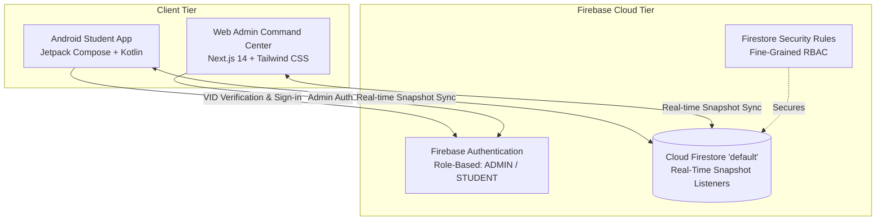

# 🍽️ MessWise OS

> **The Real-Time Operating System for Sustainable Campus Dining & Hostel Facilities.**  
> Built for university hostels to eliminate cooked food waste, streamline dining traffic, automate facility maintenance SLAs, and deliver real-time emergency broadcasts.

---

## ⚡ Highlights & Key Innovations

- ⏱️ **Predictive 3-Hour Cutoff**: Students opt in or out of meals in real time. Enforces a strict 3-hour prior cutoff to lock in headcounts before cooking begins.
- 🌿 **Gamified Green Points**: Students earn **+15 Green Points** for advance meal skips, incentivizing sustainable dining habits and reducing food waste by 35–40%.
- 📊 **Live Crowd Rush Meter**: Real-time dining hall congestion meter (🟢 Low, 🟡 Moderate, 🔴 Peak) with estimated queue wait times.
- 🚨 **Real-Time Campus & Warden Broadcasts**: Instant emergency alerts pushed to active student screens with pulsing crimson visual badges.
- 🛠️ **In-App Maintenance SLA Ticketing**: Students submit room maintenance tickets with categories (Plumbing, Electrical, Furniture); Wardens dispatch technicians in 1 click and track resolution timestamps.
- 📅 **7-Day Interactive Timetable & Generator**: Full weekly nutrition planner with calorie and allergen tags, plus an automated random timetable generator.

---

## 🏗️ System Architecture



---

## 📱 Tech Stack

### 1. Mobile Client (`/android-app`)
- **Language**: Kotlin 2.0
- **UI Framework**: Jetpack Compose BOM, Material 3
- **Architecture**: MVI / MVVM with StateFlow & Coroutines
- **Dependency Injection**: Dagger Hilt
- **Networking & Data**: Firebase Firestore KTX (Multi-database `"default"`), Firebase Auth KTX
- **Image Loading**: Coil Compose

### 2. Web Admin Command Center (`/web-admin`)
- **Framework**: Next.js 14 (App Router)
- **Language**: TypeScript
- **Styling**: Tailwind CSS, Vanilla CSS animations
- **Icons**: Lucide React
- **Backend SDK**: Firebase JS SDK 10 (Real-time snapshots)

### 3. Cloud & Security
- **Database**: Google Cloud Firestore (Native `"default"` instance)
- **Authentication**: Firebase Authentication (Email/Password & Role claims)
- **Security**: Custom `firestore.rules` enforcing granular student write isolation (matched by VID) and admin-only privileges.

---

## 🚀 Getting Started

### Prerequisites
- Node.js 18+ and npm
- Android Studio Ladybug / Koala (or JDK 17/21)
- Firebase CLI (`firebase-tools`)

### Running the Web Admin
```bash
cd web-admin
npm install
npm run dev
```
Open [http://localhost:3000](http://localhost:3000) to access the Admin Command Center.

### Building & Running the Android App
```bash
cd android-app
.\gradlew.bat assembleDebug
```
The compiled APK will be located at:
`android-app/app/build/outputs/apk/debug/app-debug.apk`

---

## 📄 Deliverables & Pitch Materials
- **Presentation Deck (`.pptx`)**: `MessWise_OS_Pitch_Deck.pptx` (Widescreen 16:9, 8 custom slides)
- **Printable Hackathon Notes (`.pdf`)**: `MessWise_OS_Hackathon_Notes.pdf`
- **Security Rules**: `firestore.rules`

---

## 📜 License
This project is open-source under the MIT License.
